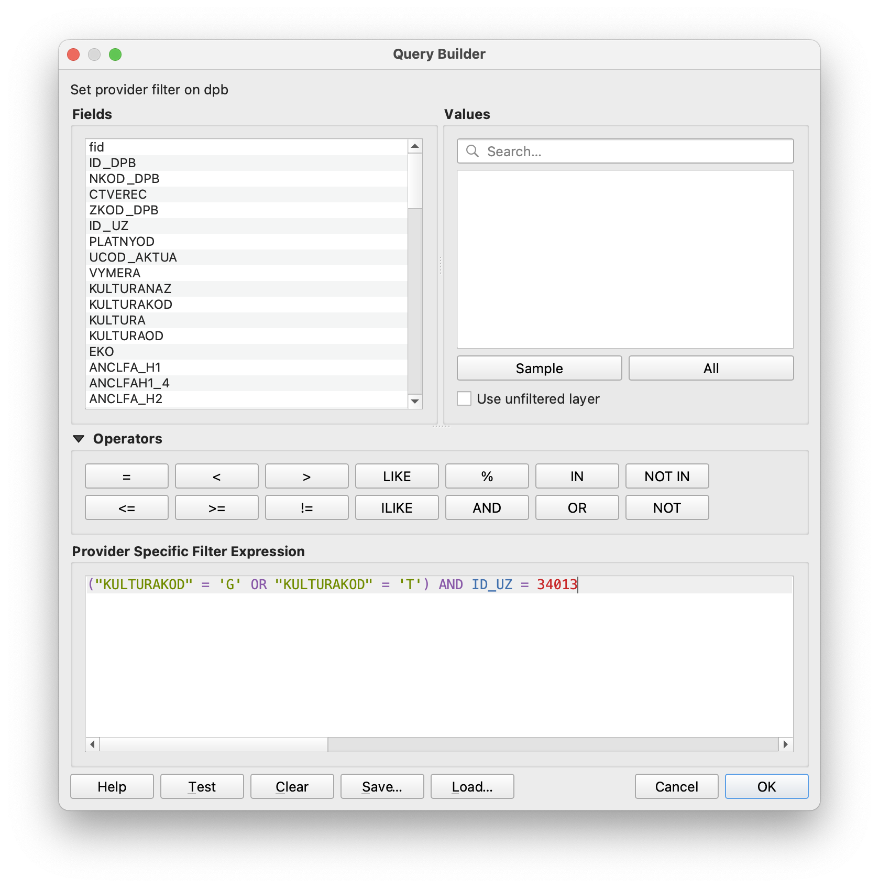

# Základní vykreslení půdních bloků z LPIS v QGIS

## Inicializace

Před použitím v roce 2025 bude třeba stáhnout pro vybrané okresy z LPIS databázi půdních bloků.
V ``okresy.csv`` je příklad - co nepotřebujete, zakomentujte pomocí ``#``.

Jako příklad je přiložena kopie veřejně dostupných dat z LPIS k 15.6.2024.

Pro stažení je předpokládán ``bash``, ``wget`` a GDAL. Pokud to někdo přepíšete pro Windows, sem s tím.

Spusťe ``get.sh``, skript postahuje ZIP archivy se SHP daty DPB bloků, rozbalí je, převede do EPSG:32633, uloží do GeoPackage a vytvoří index přes ``ZKOD_DPB`` a ``CTVEREC``.

## Běžné použití

V ``lpis.csv`` vypište čísla čtverců a DPB dle informace od zemědělce.

Spusťe QGIS, otevřete projekt ``qgis-lpis.qgz``.

Po načtení se ve virtuální vrstvě ``dnesni`` objeví DPB bloky vybrané v CSV souboru.

Pokud nevíte blok, ale víte obec, ve vrstvě ``dnesni-vsechny-ctverce`` jsou připravené k zobrazení bloky s uvedenými čísly ze všech čtverců. Bude jich hodně.

Pokud víte družstvo, lze s výhodou použít filtr pomocí ``ID_UZ``, viz níže.

## Export pro FlightHub

Do FlightHub lze importovat všechny plochy pro daný den jako jeden KML. V kontextovém menu vrstvy: *Export/Save features as*.

V nastavení exportu přiřaďte ``ZKOD_DPB`` jako výstupní název ``Name`` a vypněte persist layer symbology.

## Vytažení všech ploch jednoho družstva
Ve veřejném LPIS exportu nejsou jména zemědělských družstev, ale je tam položka ``ID_UZ``, která odpovídá číslu v závorce za jménem ZD ve webovém rozhraní.

Pokud víte alespoň jeden blok daného družstva, zjistíte provozovatele přes [Veřejný registr půdy - LPIS](https://eagri.cz/public/app/lpisext/lpis/verejny2/plpis/):

Nebo pokud nepotřebujete vědět jméno, v QGIS rozkliknutím atributů daného bloku (Nástroj *Identify features*).

Následně použijete filter nad ``dpb`` vrstvou v QGIS (kontextové menu vrstvy, *Filter*). Pokud chcete plochy s trávou (typy T a G):

A výstupem jsou všechny plochy pro dané ZD:

### Vytvoření virtuálního pole s popisem

Pokud chceme exportovat DPB do souborů se jménem dle bloku a čtverce, můžeme si jméno souboru připravit do virtuálního pole (pomocí Field calculator ve vlastnostech vrstvy):

Takhle exportovaná vrstva potom bude mít jako jméno v Google Earth nebo FlightHub údaje o DPB a čtverci.

### Uložení po jednotlivých DPB

Z KML vytvořeného v předchozím bloku už můžeme pomocí *Split vector layer* v Processing toolbox vytvořit jeden soubor pro každou plochu:

## Odkazy

K získávání dat z LPIS viz [Portál farmáře](https://eagri.cz/public/portal/mze/farmar/LPIS/uzivatelske-prirucky/prirucky-pro-verejny-lpis/export-dat-lpis).

