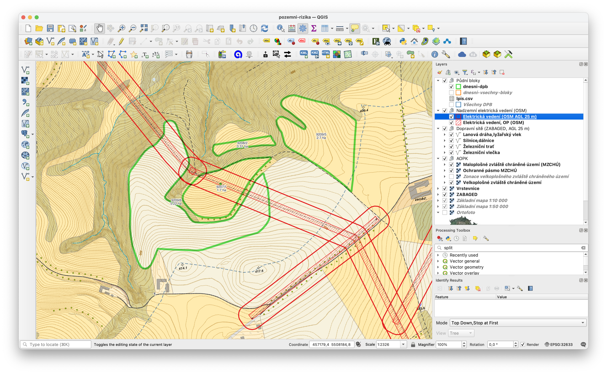

# Pozemní rizika

V ``pozemni-rizika.qgz`` je QGIS projekt zahrnující liniové stavby a umožňující vykreslit půdní bloky vypsané v lpis.csv.

Nejsou tu zohledněna ochranná pásma vodních zdrojů, rizika ve vzduchu, hustě osídlené oblasti a ptačí rezervace (a možná ještě něco dalšího).

Data o elektrických vedeních jsou vytažená z OpenStreetMap.org pomocí Overpass API, pomocí QuickOSM pluginu.
V roce 2025 nejspíš budou trochu neaktuální.

Silnice a železnice jsou z ČÚZK ZABAGED polohopisu (on-line).

## Příprava

Před prvním použitím stáhněte DPB data pro žádoucí kraje, viz [LPIS v QGIS](lpis.md).

## Údaje o půdních blocích

Je použit stejný ``lpis.csv``, tj. pokud tam jsou čtverce i DPB, zobrazí se tu.

## Příklad

Pro podklad jsou použity on-line základní topografické mapy ČÚZK (CC BY 4.0).
